# Sistem Informasi Inventori_Barang

## Deskripsi
Sistem Informasi Inventori Barang adalah aplikasi desktop yang dirancang untuk membantu proses pengelolaan inventori barang secara terkomputerisasi. Sistem ini mempermudah pencatatan data barang, transaksi barang masuk, barang keluar, serta pembuatan laporan inventori secara otomatis.

Aplikasi ini dikembangkan menggunakan Java Desktop Application dengan MySQL sebagai database penyimpanan data.

Tujuan dari sistem ini adalah untuk meningkatkan efisiensi pengelolaan stok barang serta meminimalisir kesalahan pencatatan yang sering terjadi pada sistem manual.

---

## Fitur Sistem

Berdasarkan hasil analisis kebutuhan sistem, aplikasi ini memiliki beberapa fitur utama:

### Manajemen Data
- Pengelolaan data barang
- Pengelolaan data supplier
- Pengelolaan data karyawan / admin
### Transaksi Inventori
- Transaksi barang masuk
- Transaksi barang keluar
- Transaksi return barang
### Sistem Laporan
- Laporan barang masuk
- Laporan barang keluar
- Laporan return barang
### Sistem Login
- Login admin
- Login karyawan
- Dashboard sesuai hak akses pengguna

---

## Framework yang Digunakan

- Java
- NetBeans IDE
- MySQL
- Apache Ant

---

## Desain Sistem

Desain sistem merupakan tahap perancangan yang dilakukan setelah proses analisis kebutuhan sistem selesai. Pada tahap ini dilakukan perancangan struktur sistem yang bertujuan untuk memberikan gambaran mengenai alur proses, hubungan antar data, serta tampilan antarmuka yang akan digunakan dalam aplikasi Sistem Informasi Inventori Barang.

### Diagram Konteks

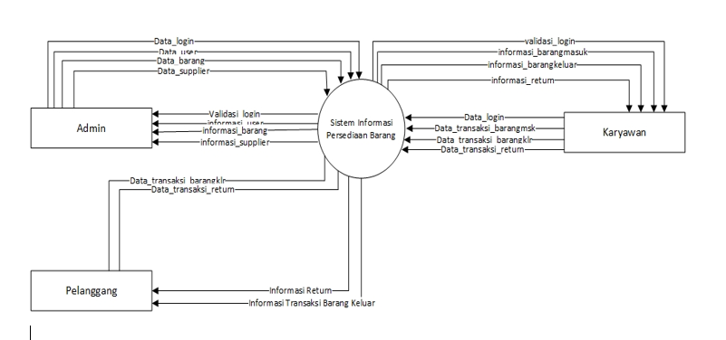

### DFD Level 1

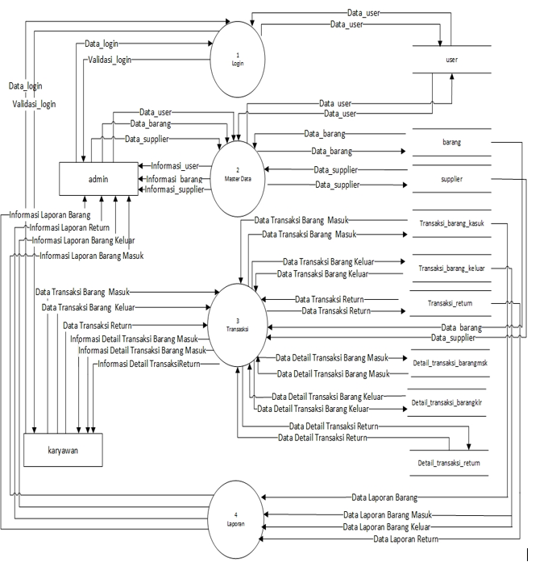

### DFD Level 2 Proses 2

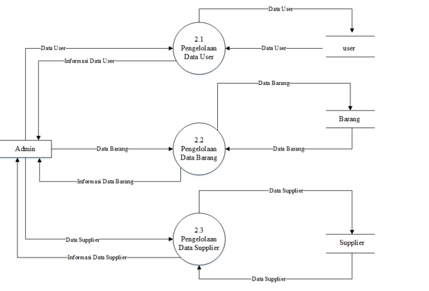

### DFD Level 2 Proses 3

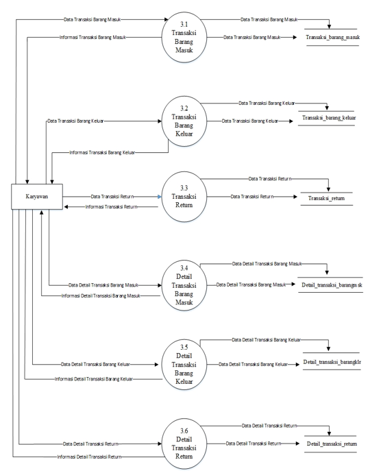

### DFD Level 2 Proses 4

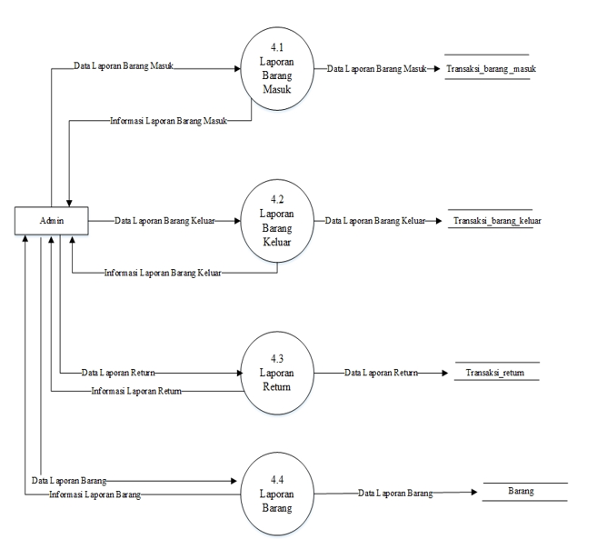

### ERD

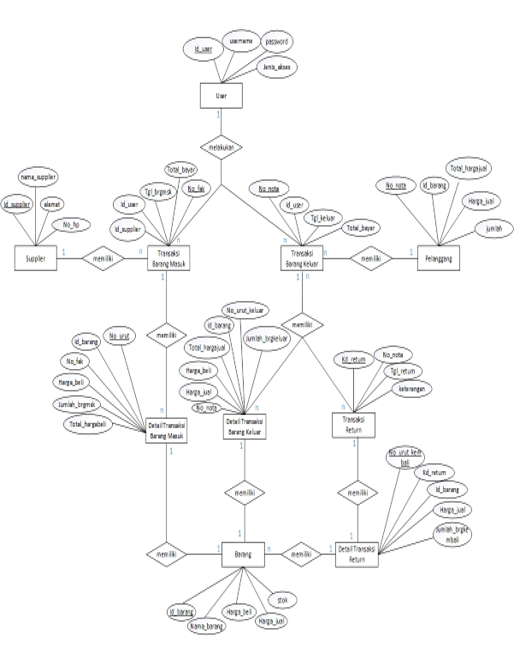

### Relasi Tabel

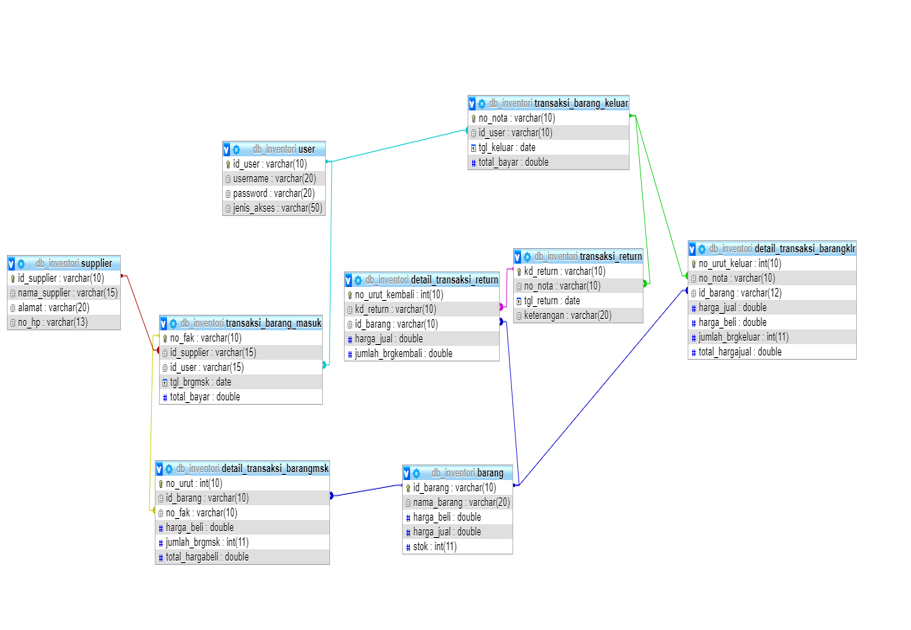

---

## Interface

Berikut adalah beberapa tampilan antarmuka dari aplikasi Sistem Informasi Inventori Barang.

### Halaman Login
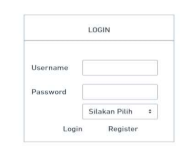

### Dashboard Admin
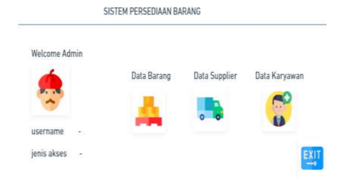

### Dashboard Karyawan
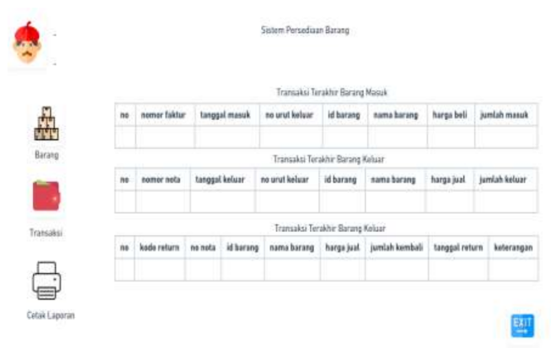

### Data Barang
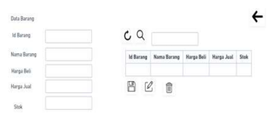

### Data Supplier
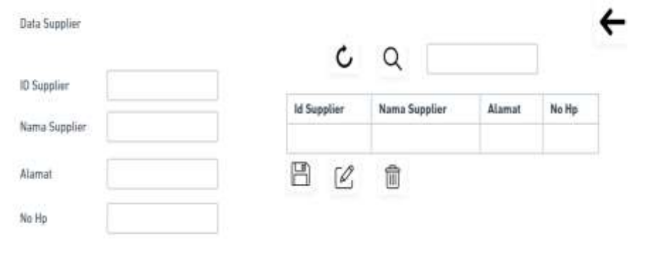

### Transaksi Masuk 
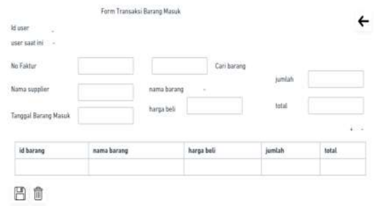

### Transaksi Keluar
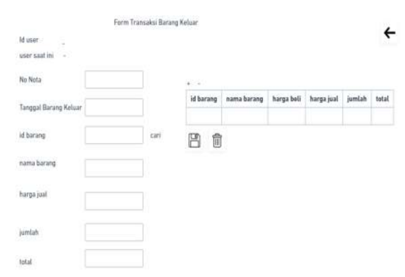

### Return
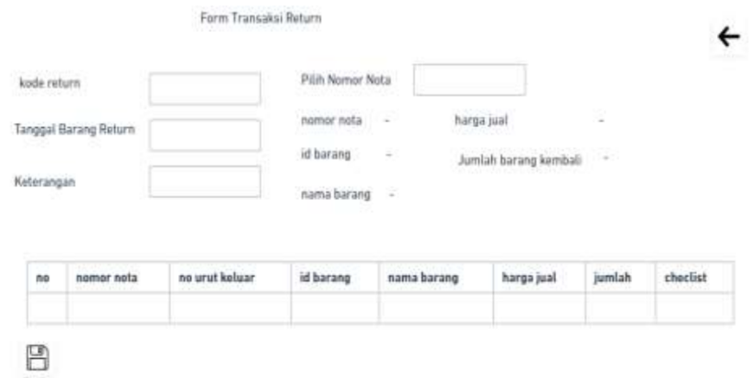

### Laporan
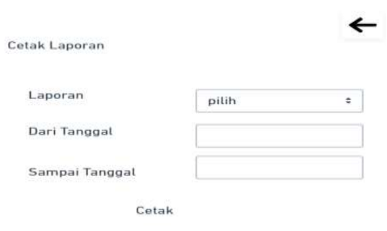

---

## Cara Menjalankan Project

1. Clone repository (git clone https://github.com/agungza/Inventori_Barang.git)
2. Buka project di NetBeans
3. Jalankan project

---

## Author

Agung Zakaria  
https://github.com/agungza
